# Strategy Engine Architecture Map

## Multi-Strategy Ensemble System

```mermaid
graph TD
    %% --- INPUTS ---
    User([👤 User Policy]) -->|"Capital & Weights"| L0
    Market([📊 Market Data]) -->|OHLCV| L1

    subgraph "Phase 1: Intelligence"
        L0[L0: User Policy] --> L1
        L1[L1: Data & Features] -->|"Vol, Mom, Trend"| L2
        L2[L2: Regime HMM] -->|"Bull-Quiet"| L4
        L2 -->|"Stability: 0.8"| L6
    end

    subgraph "Phase 2: Strategy Selection"
        L3[(L3: Strategy Universe<br/>40 strategies by Style)]
        L4[L4: Load YAML] -->|"10 for Bull-Quiet"| L4B
        L4B[L4.5: Global Bandit] -->|"Pod Filter → 5 strategies"| L3
        L3 -->|"Signal + Confidence"| L5
    end

    subgraph "Phase 3: Hierarchical Bandit"
        L5[L5: Bandit Weights]
        GB[Global Bandit] -->|"Pod Weight"| L5
        RB[Regime Bandit x4] -->|"Strategy Weight"| L5
        SB[Stock Bandit xN] -->|"Stock Weight"| L5
        L5 -->|"BanditWeight = G×R×S"| L6
    end

    subgraph "Phase 4: Scoring"
        L6[L6: 4-Factor Score]
        L6 -->|"Signal × Confidence × Stability × BanditW"| Winner
        Winner[Winner: Highest Score] --> L7
    end

    subgraph "Phase 5: Position Sizing"
        User -->|"Base: 10%"| L7
        Market -->|"GARCH Vol"| L7
        L2 -->|"Stability"| L7
        L7[L7: Size = User × VolScalar × Stability] -->|"4.8%"| L8
    end

    subgraph "Phase 6: Execution"
        L8[L8: Signal Gen] -->|"BUY 50 AAPL"| L9
        L9[L9: Scheduler] -->|"T+1"| L10
        L10[L10: Trade Execution] --> L11
        L11[L11: Portfolio Update] --> L12
    end

    subgraph "Phase 7: Feedback Loop"
        L12[L12: Performance] -->|"Reward"| GB
        L12 -->|"Reward"| RB
        L12 -->|"Reward"| SB
    end
```



---

## 10-Step Pipeline Flow

| Step | Layer | Action |
|------|-------|--------|
| 1 | L2 | Detect regime + Stability Score |
| 2 | L4 | Load YAML → Get regime strategies |
| 3 | L4.5 | Global Bandit → Filter by Pod |
| 4 | L3 | Execute → Signal + Confidence |
| 5 | L5 | Get BanditWeight (G × R × S) |
| 6 | L6 | Compute 4-factor score |
| 7 | L6 | Winner = Highest Score |
| 8 | L7 | Position Sizing |
| 9 | L10/L11 | Execute → Update Portfolio |
| 10 | L12 | Feedback → Update Bandits |

---

## 4-Factor Scoring Formula

```
Strategy Score = Signal × Confidence × Stability × BanditWeight
```

| Factor | Purpose |
|--------|---------|
| Signal | Direction (+1 Buy, -1 Sell, 0 Hold) |
| Confidence | Pattern strength NOW |
| Stability | Regime certainty |
| BanditWeight | Historical trust (G × R × S) |

---

## Key Legend

- **Intelligence**: Determines *where* we are (Regime) and *how safe* (Stability)
- **Selection**: Filters 40 strategies → 5 via Pod weighting
- **Bandit**: 3-level ML learning (Global + Regime + Stock)
- **Sizing**: Independent safety layer using GARCH volatility
- **Feedback**: L12 rewards update all 3 Bandit levels
